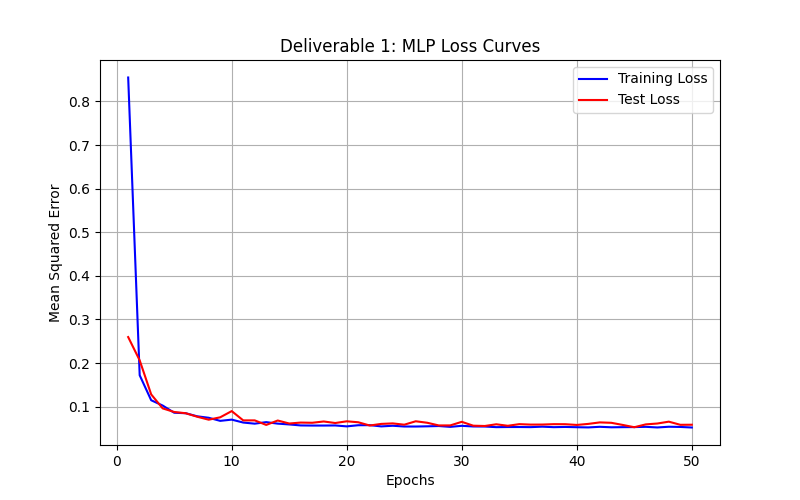
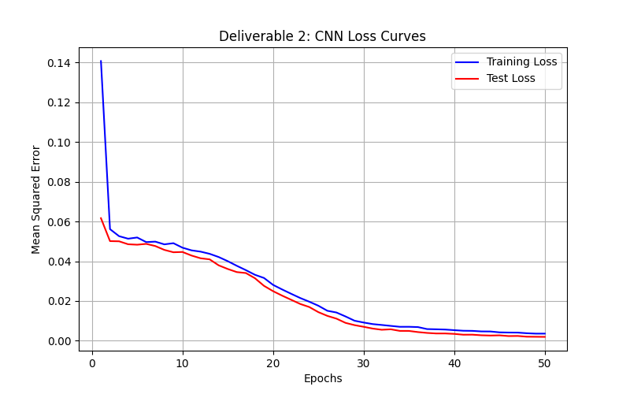
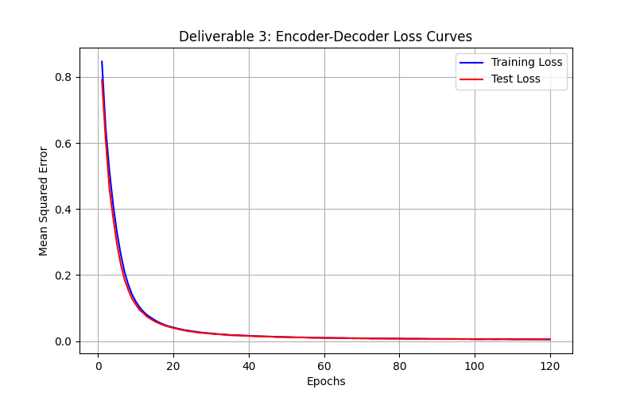
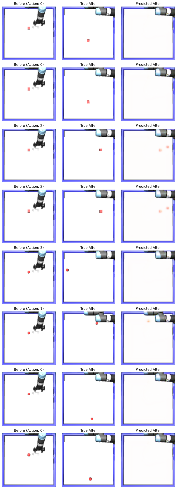

# Robot Control: Vision-Based State Prediction and Reconstruction

This repository contains the implementation of three deep learning models designed to process raw visual states and physical actions in a simulated robotic environment. The goal is to predict the future state of objects on a table after a robotic arm executes a specific pushing action.

## Model Weights
The trained model weights (`.pth` files) for all three deliverables are too large for GitHub and have been hosted externally. 
* **[Download Model Weights Here](https://drive.google.com/drive/folders/1vRdnbELEyx2eLgmHo1ZS9KkYHVwp4oMY?usp=drive_link)** 
* Download the files and place them inside a `models/` directory at the root of this project before running any evaluation scripts.

---

## Deliverable 1: Object Position Prediction (MLP)

**Objective:** Predict the final $(x, y)$ coordinates of an object from initial image and action using Multi-Layer Perceptron (MLP).

**Architecture:**
* The input consists of a $128 \times 128$ RGB image (`img_before`) and a 4-dimensional one-hot encoded action vector.
* The image is flattened into a 1D vector of $49,152$ features and concatenated with the action vector.
* The combined vector is passed through a dense network with hidden layers of sizes `[256, 64]`, utilizing ReLU activations and Dropout (0.2) for regularization.
* The output is a 2D coordinate representing the object's final position.

**Results:**
* **Final Test Error (MSE):** `0.058539`

---

## Deliverable 2: Object Position Prediction (Two-Stream CNN)

**Objective:** Predict the final $(x, y)$ coordinates of an object from initial image and action using a Convolutional Neural Network (CNN) to better preserve spatial hierarchies.

**Architecture:**
* **Visual Stream:** A 4-layer CNN (channels: 16 $\rightarrow$ 32 $\rightarrow$ 64 $\rightarrow$ 64) with $3 \times 3$ kernels and $2 \times 2$ Max Pooling compresses the $128 \times 128$ image into a compact spatial feature map.
* **Fusion Stream:** The visual features are flattened, concatenated with the 4D action vector, and passed through a dense regression head (`[256, 64]`) to output the final 2D coordinates.

**Results:**
* The CNN successfully reduced the computational overhead of the massive linear layers in the MLP while improving feature extraction through spatial invariance.
* **Final Test Error (MSE):** `0.001951`

---

## Deliverable 3: Post-Action Image Reconstruction (Encoder-Decoder CNN)

**Objective:** Generate the complete final $128 \times 128$ RGB image (`img_after`) based on the initial visual state and the applied action.

**Architecture & Engineering Choices:**
* **Bottleneck Design:** The encoder compresses the image down to a $32 \times 32$ spatial grid with 256 channels. Unlike more aggressive compression (e.g., $16 \times 16$), I think stopping at $32 \times 32$ preserves the physical footprint of the small target object, preventing it from being mathematically erased by the convolutional filters.
* **Action Broadcasting:** The 4D action vector is passed through a dense embedding layer, expanded, and spatially concatenated to the $32 \times 32$ visual bottleneck.
* **Bilinear Upsampling:** To prevent the checkerboard artifacts common in generative transposed convolutions, the decoder relies on Bilinear Upsampling followed by standard `Conv2d` layers.
* **Combined Loss Function:** Due to severe pixel class imbalance (the moving object constitutes a tiny fraction of the image), I implemented a custom loss function. It combines `MSELoss` (to stabilize the static background and robotic arm) with a weighted `L1Loss` targeting the Red channel ($\times 2.0$) to act as a soft prior, gently forcing the network's attention toward the object's movement.

**Analysis of Results:**
The network successfully learns the static background, the final retracted state of the robotic arm, and the directional movement of the object. However, the predicted objects exhibit visual blurring, sometimes seem duplicated and sometimes not reconstructed. I think this is likely due to the inherent difficulty of the task and the pixel-level precision required. The combined loss function I implemented helps mitigate this by emphasizing the importance of accurately reconstructing the red channel, which is crucial for identifying the object's position and movement. The final test error of `0.005313` indicates that while the model captures the overall structure and movement, there is still room for improvement in achieving sharper reconstructions.

**Results:**
* **Final Test Error (Combined Loss: MSE + L1):** `0.005313`

### Loss Curve

### Reconstruction Grid
*(Left: Initial State & Action, Middle: Ground Truth Final State, Right: Predicted Final State. Each row corresponds to a separate simulation and is from the test set -not seen during training-)*
